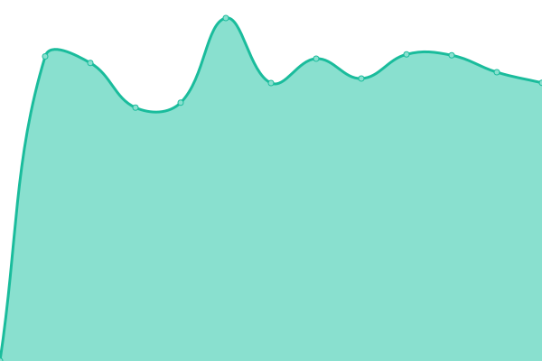

# [📈 Live Status](https://xenmate.github.io/mon-ss): <!--live status--> **🟧 Partial outage**

This repository contains the open-source uptime monitor and status page for [xenmate](https://xenmate.github.io/mon-ss), powered by [Upptime](https://github.com/upptime/upptime).

With [Upptime](https://upptime.js.org), you can get your own unlimited and free uptime monitor and status page, powered entirely by a GitHub repository. We use [Issues](https://github.com/xenmate/mon-ss/issues) as incident reports, [Actions](https://github.com/xenmate/mon-ss/actions) as uptime monitors, and [Pages](https://xenmate.github.io/mon-ss) for the status page.

<!--start: status pages-->
<!-- This summary is generated by Upptime (https://github.com/upptime/upptime) -->
<!-- Do not edit this manually, your changes will be overwritten -->
<!-- prettier-ignore -->
| URL | Status | History | Response Time | Uptime |
| --- | ------ | ------- | ------------- | ------ |
|  [StopSpoof](https://stopspoof.com) | 🟩 Up | [stop-spoof.yml](https://github.com/xenmate/mon-ss/commits/HEAD/history/stop-spoof.yml) | 

 2568ms
     
 | 

<a href="https://xenmate.github.io/mon-ss/history/stop-spoof">99.14%</a>
    

|  [DmarcX](https://dmarcx.com) | 🟥 Down | [dmarc-x.yml](https://github.com/xenmate/mon-ss/commits/HEAD/history/dmarc-x.yml) | 

 0ms
     
 | 

<a href="https://xenmate.github.io/mon-ss/history/dmarc-x">100.00%</a>
    

<!--end: status pages-->

[**Visit our status website →**](https://xenmate.github.io/mon-ss)

## 📄 License

- Powered by: [Upptime](https://github.com/upptime/upptime)
- Code: [MIT](./LICENSE) © [xenmate](https://xenmate.github.io/mon-ss)
- Data in the `./history` directory: [Open Database License](https://opendatacommons.org/licenses/odbl/1-0/)
